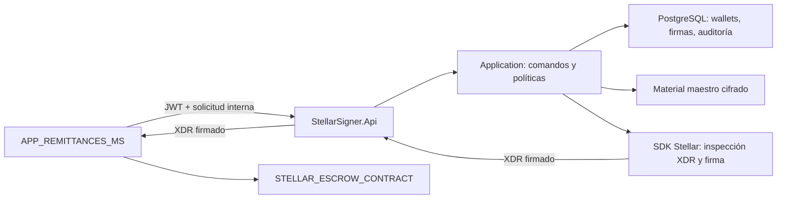
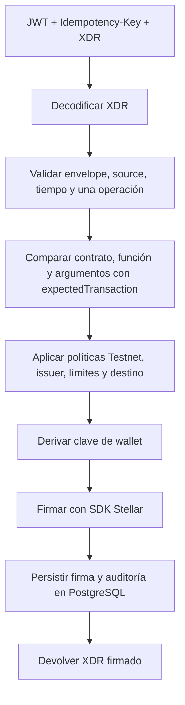

# APP_STELLAR_SIGNER

## JWT compartido con Remittances

Para este MVP, `APP_REMITTANCES_MS` y el Signer validan la misma firma HMAC mediante
`Jwt__SigningKey`. El Signer recibe un JWT interno de corta duración, emitido por Remittances con
`Jwt__Issuer`, audiencia `Jwt__Audience=stellar-signer`, `client_id=remittances-ms` y scope
`stellar-signer.execute`. No recibe ni acepta como sustituto el access token de un usuario final.
Los valores `Jwt__Issuer`, `Jwt__Audience` y `Jwt__SigningKey` son obligatorios y deben llegar de
la configuración externa; nunca se guardan claves en este repositorio.

Para integrar este servicio desde `APP_REMITTANCES_MS`, comienza por [AGENTS.md](AGENTS.md): contiene el contrato HTTP, el XDR aceptado y las reglas de reintento.

Microservicio interno .NET 9 para derivar cuentas Stellar Testnet de socios y firmar transacciones Soroban autorizadas. No administra remesas, no calcula montos comerciales, no ejecuta el contrato y no transmite transacciones a Horizon ni RPC. La API solo devuelve información pública de wallets o el XDR firmado tras validar el XDR recibido.

## Límite de confianza

`APP_REMITTANCES_MS` entrega `PartnerId`, `RemittanceId`, `RequestId`, clave de idempotencia y contexto esperado. El Signer trata esos valores como datos externos: lee la transacción real del XDR, compara sus argumentos con el contexto y aplica políticas propias antes de derivar la clave. El JWT del servicio llamador debe contener el scope `stellar-signer.execute`. El contrato y el issuer autorizados se configuran fuera del repositorio.



Proyectos en la raíz: `StellarSigner.Api` (Controllers, JWT, health), `StellarSigner.Application` (casos de uso, puertos y validación), `StellarSigner.Domain` (entidades y estados), `StellarSigner.Infrastructure` (adaptadores de PostgreSQL, criptografía, Stellar y políticas), `StellarSigner.Bootstrap` (inicialización única), y tres proyectos en `Tests` (unitarias, integración y seguridad). Las dependencias del dominio apuntan hacia afuera mediante interfaces de Application.

## Base de datos y migraciones

La única base de datos es PostgreSQL, mediante EF Core 9 y `Npgsql.EntityFrameworkCore.PostgreSQL`. `SignerDbContext` y `DesignTimeSignerDbContextFactory` están en `StellarSigner.Infrastructure/DrivenAdapter/Persistence`. La fábrica permite usar `dotnet ef` sin iniciar la API. Todas las columnas usan `snake_case`; los montos son `numeric(20,7)`. La migración `InitialCreate` crea `partner_wallets`, `wallet_derivation_counters`, `signing_requests`, `audit_records`, índices únicos, checks, FK y `__EFMigrationsHistory`. Todas las PK internas son UUID con `DEFAULT gen_random_uuid()` en PostgreSQL; los IDs externos permanecen intactos.

`wallet_derivation_counters` tiene una sola fila lógica (`name = 'wallets'`) y un UUID generado por PostgreSQL. La reserva ejecuta `INSERT ... ON CONFLICT` y `UPDATE ... RETURNING` dentro de una transacción, con un bloqueo de asesoría por socio. Esto serializa las solicitudes concurrentes y evita `MAX(index)+1`. Las restricciones únicas de `partner_id`, `public_key` e `derivation_index` son la segunda barrera. La tabla de firmas tiene unicidad sobre `request_id` e `idempotency_key`; las solicitudes iguales devuelven el XDR firmado persistido y las diferentes reciben 409. La auditoría es append-only desde EF.

Primero cree `.env` desde `.env.example` y asigne contraseñas aleatorias distintas a `POSTGRES_ADMIN_PASSWORD` y `SIGNER_DB_PASSWORD`. Luego:

```bash
docker compose up -d postgres
```

Configure `ConnectionStrings__SignerDb` en el shell que ejecutará `dotnet ef`. En Windows local: `Host=localhost;Port=54329;Database=stellar_signer;Username=signer;Password=<SIGNER_DB_PASSWORD>`. Dentro de Docker: `Host=postgres;Port=5432;Database=stellar_signer;Username=signer;Password=<SIGNER_DB_PASSWORD>`.

Crear una migración nueva:

```bash
dotnet ef migrations add NombreMigracion --project StellarSigner.Infrastructure --startup-project StellarSigner.Api --context SignerDbContext --output-dir DrivenAdapter/Persistence/Migrations
```

Listar migraciones:

```bash
dotnet ef migrations list --project StellarSigner.Infrastructure --startup-project StellarSigner.Api --context SignerDbContext
```

Aplicarlas:

```bash
dotnet ef database update --project StellarSigner.Infrastructure --startup-project StellarSigner.Api --context SignerDbContext
```

Revertir la última migración durante desarrollo: sustituya `MigracionAnterior` por el nombre anterior, o `0` si se revierte la inicial. Después retire los archivos de la migración que ya no está aplicada.

```bash
dotnet ef database update MigracionAnterior --project StellarSigner.Infrastructure --startup-project StellarSigner.Api --context SignerDbContext
dotnet ef migrations remove --project StellarSigner.Infrastructure --startup-project StellarSigner.Api --context SignerDbContext
```

Generar un script SQL idempotente para despliegue:

```bash
dotnet ef migrations script --idempotent --project StellarSigner.Infrastructure --startup-project StellarSigner.Api --context SignerDbContext -o signer-idempotent.sql
```

Para imprimir el mismo script en stdout, omita `-o signer-idempotent.sql`:

```bash
dotnet ef migrations script --idempotent --project StellarSigner.Infrastructure --startup-project StellarSigner.Api --context SignerDbContext
```

El comando de migración inicial realmente utilizado fue:

```bash
dotnet ef migrations add InitialCreate --project StellarSigner.Infrastructure --startup-project StellarSigner.Api --context SignerDbContext --output-dir DrivenAdapter/Persistence/Migrations
```

## Material maestro y derivación

`Bootstrap` genera una mnemonic BIP-39 de 24 palabras con NBitcoin, deriva la seed BIP-39 y obtiene el nodo maestro SLIP-0010 Ed25519. Muestra las palabras una sola vez, exige escribir `BACKED_UP` y guarda solo la clave privada maestra y el chain code en un payload versionado cifrado con AES-256-GCM. El nonce es aleatorio y la versión forma parte de los datos autenticados. La contraseña de envoltura `SIGNER_WRAP_KEY` debe ser base64 de **32 bytes aleatorios**, obtenida de un gestor de secretos o un generador criptográfico. No se guarda en el archivo, la base de datos ni la imagen. El archivo se crea sin sobrescritura, con permisos de usuario en Unix y una ACL exclusiva del operador en Windows. Si la API corre con otra cuenta, conceda acceso de lectura a esa cuenta de forma deliberada.

Configure `SIGNER_WRAP_KEY` y `SIGNER_MASTER_KEY_FILE` en el entorno del operador, con la segunda apuntando a una ruta protegida fuera del repositorio. Ejecute una sola vez:

```bash
dotnet run --project StellarSigner.Bootstrap/StellarSigner.Bootstrap.csproj
```

Respalde las 24 palabras offline antes de confirmar. No redirija la salida de Bootstrap a archivos ni a registros. Custodie la mnemonic y la clave de envoltura por separado. La ruta de cada socio es `m/44'/148'/{index}'`; solo se derivan hijos endurecidos. El Signer reabre el payload cifrado bajo demanda, deriva el seed de la cuenta en memoria y limpia buffers sensibles cuando es posible. Las claves privadas nunca se devuelven por HTTP ni se guardan en PostgreSQL.

## Firma Soroban



El MVP acepta únicamente un envelope V1 sin firmas previas, sin memo, con time bounds válidos, sin autorizaciones Soroban adicionales y con **una** `InvokeContractOperation`. Rechaza fee bump, operaciones adicionales, precondiciones extra y otros host functions. Las funciones permitidas son `lock_funds`, `release_funds` y `refund_funds`. El contrato y la cuenta source deben coincidir con la configuración y la wallet del socio.

**ABI asumida para el MVP:** cuatro argumentos Soroban en este orden: `SCString("USDC")`, `SCString(issuer G...)`, `SCInt128(amount en unidades de 10^-7)`, `SCString(destination G... o C...)`. El contrato real debe implementar exactamente este ABI antes de aceptar fondos; cualquier otra forma se rechaza. La red no es un campo del envelope XDR: la API exige `expectedTransaction.network = "Testnet"` y calcula la firma y el hash con la passphrase Testnet configurada. La transacción debe traer recursos Soroban preparados por el llamador; el Signer no simula ni transmite.

Ejemplo sin XDR ni identidades funcionales:

```http
POST /api/internal/v1/wallets
Authorization: Bearer <jwt-del-servicio>
Content-Type: application/json

{"partnerId":"00000000-0000-0000-0000-000000000001"}
```

```http
POST /api/internal/v1/signatures
Authorization: Bearer <jwt-del-servicio>
Idempotency-Key: <identificador-unico>
Content-Type: application/json

{"requestId":"00000000-0000-0000-0000-000000000002","remittanceId":"00000000-0000-0000-0000-000000000003","partnerId":"00000000-0000-0000-0000-000000000001","operationType":"LockFunds","unsignedTransactionXdr":"<envelope-xdr-base64>","expectedTransaction":{"network":"Testnet","assetCode":"USDC","assetIssuer":"<G-issuer-configurado>","amount":2.5,"destination":"<G-o-C-destino>"}}
```

Consultar wallet: `GET /api/internal/v1/wallets/{partnerId}`. Consultar estado de firma: `GET /api/internal/v1/signatures/{requestId}`. El GET de firmas no devuelve el XDR firmado; repetir el POST con la misma clave y payload devuelve el XDR firmado o el mismo error registrado si la solicitud fue rechazada. Todos los endpoints internos requieren JWT Bearer con issuer, audience, expiración y scope `stellar-signer.execute`. Hay límite de solicitudes y tamaño de body; no se registran bodies, XDR ni secretos. Los errores usan `ProblemDetails` con códigos estables. `GET /health/live` y `GET /health/ready` son anónimos; ready comprueba PostgreSQL y apertura íntegra del payload maestro.

## Configuración y ejecución

Variables obligatorias para la API: `ConnectionStrings__SignerDb`, `SIGNER_WRAP_KEY`, `SIGNER_MASTER_KEY_FILE`, `Stellar__Issuer` (G válido), `Stellar__ContractId` (C válido), `Jwt__Issuer`, `Jwt__Audience` y `Jwt__SigningKey`. Ajustes opcionales: `Jwt__RequiredScope`, `Jwt__AllowedClientId`, `Stellar__MaxAmount`, `Stellar__MaxRemainingSeconds`, `RateLimit__PermitLimit`. `Stellar__NetworkPassphrase` solo admite la passphrase oficial de Testnet. `Stellar__MaxOperations` debe ser 1.

Con PostgreSQL y el payload ya preparados:

```bash
dotnet run --project StellarSigner.Api/StellarSigner.Api.csproj
```

Para usar Docker Compose local, rellene `.env`, coloque el payload cifrado en `private/master.enc` y ejecute `docker compose up --build -d`. Compose publica solo en `127.0.0.1`, usa un usuario PostgreSQL sin privilegios administrativos y un volumen persistente. Compose local usa `Development`; OpenAPI está disponible solo ahí. En Production configure un listener HTTPS y un certificado fuera del repositorio. La API rechaza peticiones HTTP en Production y no habilita CORS abierto.

## Pruebas

```bash
dotnet build APP_STELLAR_SIGNER.sln
dotnet test APP_STELLAR_SIGNER.sln
```

Las pruebas de integración usan **PostgreSQL real con Testcontainers** y aplican la migración con `MigrateAsync()`. Requieren un motor Docker accesible. En este entorno Windows con Docker Desktop se ejecutaron con `DOCKER_HOST=npipe://./pipe/dockerDesktopLinuxEngine` y `TESTCONTAINERS_RYUK_DISABLED=true` porque el pull de Ryuk encontró un error de autenticación; los contenedores de prueba se cierran al terminar. Se comprueban tablas, UUID server-side, restricciones únicas, transacciones, reserva concurrente, idempotencia, persistencia, auditoría, derivación, inspección y firma Soroban. Las pruebas de seguridad cubren alteración de AES-GCM y XDR, operación adicional, políticas y autenticación de endpoints.

## Dependencias principales y pasos antes de Mainnet

`Npgsql.EntityFrameworkCore.PostgreSQL` implementa PostgreSQL y migraciones EF; `MediatR` separa comandos/queries de Controllers; `FluentValidation` valida entrada; `stellar-dotnet-sdk` decodifica XDR, codifica direcciones y firma Ed25519; `NBitcoin` genera BIP-39 en Bootstrap; `Testcontainers.PostgreSql` ejecuta PostgreSQL real en pruebas.

Se eligió [`stellar-dotnet-sdk` 15.1.0](https://www.nuget.org/packages/stellar-dotnet-sdk/15.1.0) porque su versión actual incluye tipos Soroban para `InvokeContractOperation`, decodificación de envelopes y firma, y es compatible con .NET 9. El código fuente está en [Beans-BV/dotnet-stellar-sdk](https://github.com/Beans-BV/dotnet-stellar-sdk). La derivación se contrastó con los vectores oficiales de [SEP-0005](https://github.com/stellar/stellar-protocol/blob/master/ecosystem/sep-0005.md) y la regla de hijos Ed25519 endurecidos de [SLIP-0010](https://github.com/satoshilabs/slips/blob/master/slip-0010.md).

Antes de Mainnet hay que cotejar el ABI con `STELLAR_ESCROW_CONTRACT`, probar los flujos de lock/release/refund contra el contrato desplegado, revisar el modelo de autorización Soroban y las huellas de recursos, integrar un emisor JWT real, migrar el payload y la clave de envoltura a Vault/KMS/HSM, ensayar recuperación desde la mnemonic offline y someter la política de firma y la custodia a auditoría. Si se compromete el material maestro, todas las wallets derivadas pueden ser comprometidas; la respuesta operativa debe incluir rotación, migración de fondos y revocación de credenciales.
